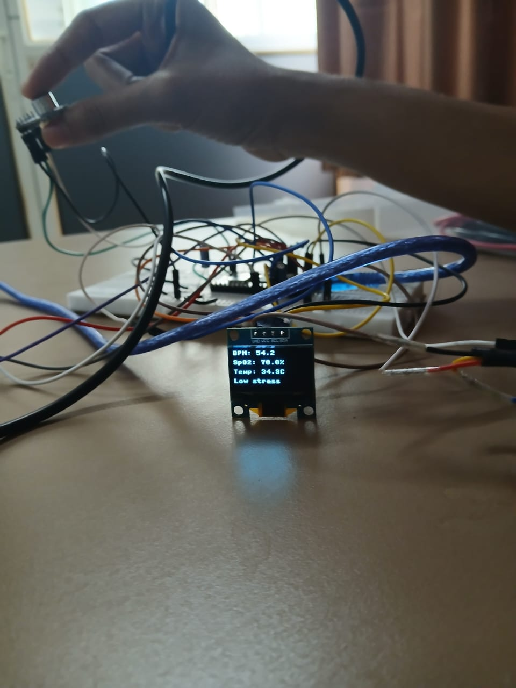

# 🩺 AI-Based Digital Stethoscope

A portable embedded health monitor built on **Raspberry Pi Pico W (ARM Cortex-M0+)**
for real-time vitals monitoring — designed for rural and low-resource healthcare settings.

## 📊 Live Output

## ✅ Features
- Real-time **BPM detection** using MAX30102 (I2C)
- **SpO2** monitoring via MAX30102
- **Body temperature** via DS18B20 (1-Wire protocol)
- **Stress classification** using HRV — SDNN + RMSSD algorithm
- Live vitals on **SSD1306 OLED** display (I2C)
- **Battery voltage monitoring** via ADC (18650 Li-ion + TP4056)

## 🔌 Hardware
| Component | Protocol | Purpose |
|---|---|---|
| Raspberry Pi Pico W | — | Main MCU |
| MAX30102 | I2C | Heart rate + SpO2 |
| DS18B20 | 1-Wire | Body temperature |
| SSD1306 OLED | I2C | Display |
| 18650 + TP4056 | ADC | Battery power |

## 📍 Pin Configuration
| Pin | Component |
|---|---|
| GP4 (SDA), GP5 (SCL) | MAX30102 (I2C0) |
| GP6 (SDA), GP7 (SCL) | OLED (I2C1) |
| GP15 | DS18B20 (1-Wire) |
| GP26 | Battery ADC |

## 🧠 Stress Classification Logic
| SDNN | RMSSD | Stress Level |
|---|---|---|
| > 50 | > 42 | 🟢 Low Stress |
| 20–50 | 20–42 | 🟡 Medium Stress |
| < 20 | < 20 | 🔴 High Stress |

## 👩‍💻 Built By
**Tanvi Mohite** — ECE Final Year, DKTE Society's Textile & Engineering Institute, Ichalkaranji
